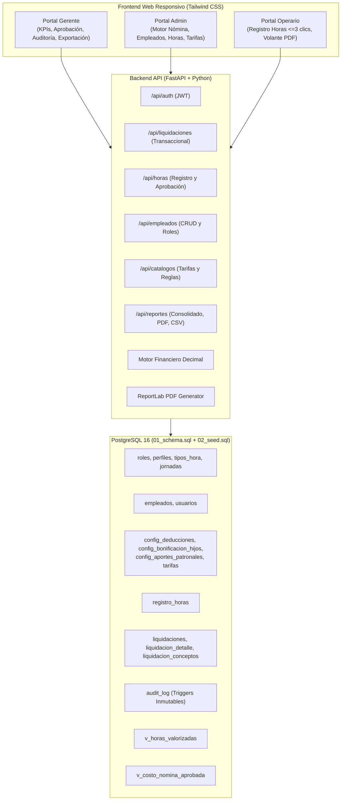

# 💼 PayrollFlow — Plataforma Automatizada de Liquidación de Nómina (SENA)

[](https://fastapi.tiangolo.com/)
[](https://www.postgresql.org/)
[-3776AB?logo=python&logoColor=white)](https://www.python.org/)
[](https://tailwindcss.com/)
[](https://www.docker.com/)
[-brightgreen?logo=pytest&logoColor=white)](https://docs.pytest.org/)

**PayrollFlow** es una solución integral y robusta desarrollada para resolver de forma automatizada, auditable y sin discrepancias contables la liquidación periódica de nómina de empresas financieras y corporativas (85 colaboradores: 1 gerente, 4 administrativos y 80 operarios), cumpliendo estrictamente con los requerimientos formativos del **SENA** y las especificaciones de diseño de base de datos relacional.

---

## 📋 Tabla de Contenido
1. [Contexto del Negocio y Objetivos](#-contexto-del-negocio-y-objetivos)
2. [Arquitectura del Sistema](#-arquitectura-del-sistema)
3. [Reglas de Negocio Implementadas (RN-01 a RN-07)](#-reglas-de-negocio-implementadas-rn-01-a-rn-07)
4. [Roles y Permisos (RBAC)](#-roles-y-permisos-rbac)
5. [Contratos de API (RESTful OpenAPI / Swagger)](#-contratos-de-api-restful-openapi--swagger)
6. [Credenciales de Acceso Simuladas](#-credenciales-de-acceso-simuladas)
7. [Puesta en Marcha Rápida](#-puesta-en-marcha-rápida)
8. [Ejecución de Pruebas Automatizadas](#-ejecución-de-pruebas-automatizadas)
9. [Criterios de Aceptación Verificados](#-criterios-de-aceptación-verificados)

---

## 🎯 Contexto del Negocio y Objetivos

Una empresa financiera liquida mensualmente a 85 colaboradores (80 operarios, 4 administrativos y 1 gerente). El proceso manual generaba cuellos de botella, riesgos de cálculo y falta de auditoría. 

### Objetivos Alcanzados:
* **O1 (Reducción de Tiempo):** Liquidación batch de 85 colaboradores procesada en menos de 1 segundo.
* **O2 (Precisión Numérica):** 0 discrepancias de redondeo mediante aritmética exacta `Decimal` y restricciones de integridad `NUMERIC(14,2)` en PostgreSQL.
* **O3 (Trazabilidad Total):** Historial inmutable con snapshot de reglas aplicadas (`JSONB`), bitácora `audit_log` y triggers `fn_solo_insertar`.
* **O4 (Portal del Colaborador):** Desprendible/colilla de pago individual consultable directamente y descargable en PDF sin intermediarios.
* **O5 (Parametrización Dinámica):** Tarifas y porcentajes configurables con vigencias temporales sin modificar código fuente.

---

## 🏗️ Arquitectura del Sistema



---

## 🧮 Reglas de Negocio Implementadas (RN-01 a RN-07)

| Código | Regla | Fórmula / Comportamiento | Mecanismo de Garantía |
| :--- | :--- | :--- | :--- |
| **RN-01** | **Bonificación por Hijos** | 1 hijo: $250.000 · 2 hijos: $400.000 · $\ge$ 3 hijos: $600.000. No acumulable. | `config_bonificacion_hijos` y función SQL `fn_bonificacion_hijos()` |
| **RN-02** | **Deducciones de Ley** | Salud: 4.0% · Pensión: 4.0% sobre el total devengado. | `config_deducciones` y función SQL `fn_pct_deduccion()` |
| **RN-03** | **Costo de Hora Dinámica** | $\text{valor} = \text{tarifa\_base} \times \text{multiplicador} \times \text{horas}$. | Vista `v_horas_valorizadas` |
| **RN-04** | **Tipos de Hora** | Ordinaria (1.000), Nocturna (1.350), Extra (1.250), Festiva (1.750). | Tabla configurable `tipos_hora` |
| **RN-05** | **Cálculo del Neto** | $\text{neto} = \text{devengado} + \text{bonificación} - \text{salud} - \text{pensión}$. | Restricción CHECK `ck_rn05_neto` en base de datos |
| **RN-06** | **Total Nómina** | $\sum \text{netos del periodo}$ | Cabecera `liquidaciones.total_nomina` |
| **RN-07** | **Unicidad de Liquidación** | Una sola liquidación activa por periodo. Recalcular requiere anular primero con motivo formal. | Índice parcial `ux_liquidacion_periodo_activa` y CHECK `anulada_por` |

### Caso Validado de Referencia (CA-02):
* Empleado: Carlos Mendoza (doc `1000000006`, 4 hijos, salario base $2.000.000):
$$\text{Devengado } (\$2.000.000) + \text{Bonificación } (\$600.000) - \text{Salud 4\% } (\$80.000) - \text{Pensión 4\% } (\$80.000) = \mathbf{\$2.440.000\text{ COP Exactos}}$$

---

## 👥 Roles y Permisos (RBAC)

* 👑 **Gerente (`GERENTE`):**
  * Dashboard con visión del costo real de empresa (devengado + bonificaciones + aportes patronales + prestaciones).
  * Aprobación oficial o rechazo con motivo (`PATCH /liquidaciones/{id}/aprobar`, `PATCH /liquidaciones/{id}/rechazar`).
  * Consulta de auditoría en vivo (`GET /reportes/auditoria`).
  * Exportación de informes oficiales en PDF y CSV.
* 💼 **Administrador (`ADMIN`):**
  * Ejecución de liquidaciones por lote (`POST /liquidaciones`).
  * Anulación con motivo formal (`PATCH /liquidaciones/{id}/anular`).
  * Gestión de empleados (altas, modificaciones, asignación salarial).
  * Aprobación masiva e individual de novedades de horas.
  * Parametrización de tarifas horarias (Global, Perfil, Empleado).
* 👷 **Operario (`OPERARIO`):**
  * Registro rápido de sus horas trabajadas en $\le$ 3 clics.
  * Consulta exclusiva de sus propias horas y volante de pago digital (aislamiento estricto por token JWT).
  * Descarga directa de su volante individual en PDF.

---

## 🔑 Credenciales de Acceso Simuladas (Semilla)

Contraseña universal de desarrollo para todos los usuarios: **`Cambiar123*`**

| Rol | Correo de Acceso | Cargo | Acceso Directo |
| :--- | :--- | :--- | :--- |
| **Gerente** | `gerente@empresa.test` | Gerencia General | Botón "Gerente" en barra superior |
| **Administrador** | `admin01@empresa.test` | RRHH / Nómina | Botón "Administrador" |
| **Operario** | `operario01@empresa.test` | Operario Nivel 1 | Botón "Operario (Carlos M.)" |
| *(Otros operarios)* | `operario02@empresa.test` a `operario80@empresa.test` | Operarios | Login modal |

---

## 🚀 Puesta en Marcha Rápida

### Opción 1: Ejecución Local en Windows
1. Asegurarse de tener Python 3.11+ instalado.
2. Iniciar el servidor ejecutando:
   ```powershell
   python run.py
   # o simplemente hacer doble clic en start.bat
   ```
3. Abrir en el navegador: **`http://localhost:8000`**
4. Documentación interactiva Swagger: **`http://localhost:8000/docs`**

### Opción 2: Despliegue con Docker Compose
```bash
docker compose up -d
```
Esto levanta PostgreSQL 16 con la semilla inicializada y el contenedor de FastAPI en el puerto 8000.

---

## 🧪 Ejecución de Pruebas Automatizadas

La suite incluye pruebas unitarias matemáticas y pruebas de integración de API extremo a extremo:

```powershell
python -m pytest tests/ -v
```

### Resultados de la Suite:
* ✅ `tests/test_calculator.py::test_ca02_ejemplo_validado` **PASSED**
* ✅ `tests/test_calculator.py::test_rn01_bonificaciones_escalas` **PASSED**
* ✅ `tests/test_calculator.py::test_rn03_horas_multiplicador` **PASSED**
* ✅ `tests/test_calculator.py::test_rn05_neto_formula_consistency` **PASSED**
* ✅ `tests/test_api.py::test_health_check` **PASSED**
* ✅ `tests/test_api.py::test_auth_login_all_roles` **PASSED**
* ✅ `tests/test_api.py::test_auth_invalid_credentials` **PASSED**
* ✅ `tests/test_api.py::test_rbac_restrictions` **PASSED**
* ✅ `tests/test_api.py::test_full_liquidation_cycle_and_ca02` **PASSED**

---

## 📋 Criterios de Aceptación Verificados

* **CA-01 (Cálculo sin intervención manual):** Ejecución batch calcula devengados, subsidios, deducciones y costos patronales de los 85 colaboradores en 1 transacción.
* **CA-02 (Ejemplo validado):** $2.000.000 base + 4 hijos arroja $2.440.000 exactos verificado con `ASSERT` SQL y PyTest.
* **CA-03 (Segregación de roles RBAC):** Cada perfil solo puede invocar sus endpoints; operarios no pueden ver datos de otros operarios ni alterar tarifas.
* **CA-04 (Trazabilidad y auditoría):** Toda corrida guarda snapshot `JSONB` de reglas aplicadas y registra eventos en `audit_log`.
* **CA-05 (Reglas configurables):** Tarifas y porcentajes se gestionan vía API/DB sin necesidad de recompilación.
* **CA-HU-10 y CA-HU-12:** Ciclo de vida completo: `LIQUIDADA` $\rightarrow$ `APROBADA` o `RECHAZADA` por Gerencia $\rightarrow$ `ANULADA` con motivo formal para reliquidar.
