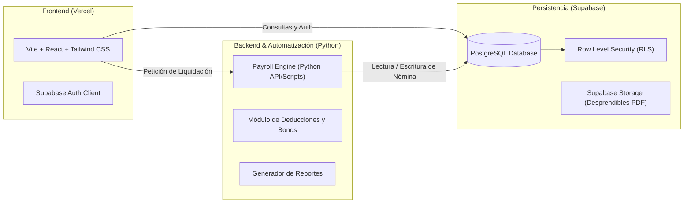

# 💼 PayrollFlow — Plataforma Automatizada de Liquidación de Nómina

[](https://vitejs.dev/)
[](https://tailwindcss.com/)
[](https://www.python.org/)
[-3ECF8E?logo=supabase&logoColor=white)](https://supabase.com/)
[](https://vercel.com/)

**PayrollFlow** es una solución integral y moderna diseñada para empresas del sector financiero y corporativo que simplifica, centraliza y automatiza el cálculo y liquidación de nómina de los colaboradores, reduciendo errores manuales, garantizando el cumplimiento de deducciones legales y gestionando beneficios familiares de manera dinámica y transparente.

---

## 📋 Tabla de Contenido
1. [Análisis del Problema y Justificación](#-análisis-del-problema-y-justificación)
2. [Arquitectura y Stack Tecnológico](#-arquitectura-y-stack-tecnológico)
3. [Perfiles de Usuario y Matriz de Permisos](#-perfiles-de-usuario-y-matriz-de-permisos)
4. [Reglas de Negocio y Lógica de Liquidación](#-reglas-de-negocio-y-lógica-de-liquidación)
5. [Estructura del Proyecto](#-estructura-del-proyecto)
6. [Modelo de Datos Previsto (Supabase / PostgreSQL)](#-modelo-de-datos-previsto-supabase--postgresql)
7. [Organización del Equipo de Desarrollo (6 Integrantes)](#-organización-del-equipo-de-desarrollo-6-integrantes)
8. [Guía de Configuración Local](#-guía-de-configuración-local)
9. [Convenciones de Git y Flujo de Trabajo](#-convenciones-de-git-y-flujo-de-trabajo)

---

## 🎯 Análisis del Problema y Justificación

### Contexto de la Problemática
En la gestión contable tradicional, la liquidación de empleados se realiza comúnmente a través de hojas de cálculo descentralizadas o herramientas estáticas. Esto genera:
* **Inconsistencias en tarifas por hora:** Empleados con diferentes cargos o perfiles tienen costos de hora variables que cambian periódicamente. Modificarlos a mano genera desfases contables.
* **Cálculo manual de auxilios y bonificaciones:** La asignación de beneficios familiares (subsidio por hijos) suele requerir revisión manual caso por caso.
* **Riesgo en deducciones de ley:** Retenciones obligatorias (salud, pensión, ARL) calculadas erróneamente conllevan sanciones legales y reclamos laborales.
* **Falta de trazabilidad y desprendibles transparentes:** Dificultad para que los directivos auditen la nómina consolidada y para que los empleados verifiquen el desglose exacto de su pago.

### Solución Propuesta
**PayrollFlow** automatiza el ciclo completo:
1. **Parametrización previa:** Configuración flexible de los perfiles de cargo y su respectivo costo de hora dinámica.
2. **Vinculación contractual:** Registro de empleados asociando perfil, número de dependientes (hijos) y novedades de horas trabajadas.
3. **Motor de liquidación automatizado:** Algoritmo en Python conectado a Supabase que ejecuta los cálculos matemáticos y fiscales con precisión al centavo.
4. **Segregación de roles y visualización:** Interfaz web en React + Tailwind con vistas especializadas para Gerencia, Administración y Operarios.

---

## 🛠️ Arquitectura y Stack Tecnológico



* **Frontend:** [Vite](https://vitejs.dev/) + [React](https://react.dev/) + [Tailwind CSS](https://tailwindcss.com/) — Rápido, reactivo, interfaz limpia y responsiva.
* **Backend y Automatización:** [Python](https://www.python.org/) (FastAPI / Scripts de Automatización) — Procesamiento de lotes de nómina, validaciones numéricas e integración continua.
* **Base de Datos & Auth:** [Supabase](https://supabase.com/) — PostgreSQL relacional con Row Level Security (RLS) y autenticación segura con JWT.
* **Hosting & Despliegue:** [Vercel](https://vercel.com/) (Frontend y Serverless Functions) + Supabase Cloud.

---

## 👥 Perfiles de Usuario y Matriz de Permisos

| Módulo / Funcionalidad | Gerente | Administrador (RRHH) | Operario |
| :--- | :---: | :---: | :---: |
| **Dashboard Consolidado (Total Nómina, KPIs)** | ✅ Lectura | ✅ Lectura | ❌ |
| **Aprobación Oficial de Liquidación** | ✅ Completo | ❌ | ❌ |
| **Configuración de Perfiles y Tarifa Horaria Dinámica** | 👁️ Solo Lectura | ✅ Creación / Edición | ❌ |
| **Gestión de Empleados (Altas, Bajas, Hijos)** | 👁️ Solo Lectura | ✅ Completo | ❌ |
| **Registro de Horas Laboradas** | 👁️ Auditoría | ✅ Registro masivo / revisión | 👁️ Registro personal |
| **Ejecución del Motor de Liquidación** | ❌ | ✅ Ejecución | ❌ |
| **Consulta de Desprendible de Pago Individual** | 👁️ Todos | 👁️ Todos | ✅ Solo propio |

---

## 🧮 Reglas de Negocio y Lógica de Liquidación

### 1. Parametrización Previa Obligatoria
Antes de iniciar un ciclo de liquidación, cada perfil de trabajo debe tener asignado su **Costo por Hora Dinámica**. Ningún empleado puede liquidarse sin un perfil vigente y validado.

### 2. Salario Base Devengado
$$\text{Salario Base} = \text{Horas Trabajadas} \times \text{Tarifa Horaria del Perfil}$$

### 3. Subsidio / Bonificación por Hijos
Auxilio familiar otorgado según la cantidad de hijos registrados:
* **0 hijos:** $\$0$ COP
* **1 hijo:** $\$250,000$ COP
* **2 hijos:** $\$400,000$ COP
* **3 o más hijos:** $\$600,000$ COP *(Ejemplo: 4 hijos $\rightarrow$ $\$600,000$ COP)*

### 4. Deducciones de Ley (Seguridad Social)
Calculadas sobre el Salario Base:
* **Salud (EPS):** $4.0\%$ a cargo del colaborador.
* **Pensión (AFP):** $4.0\%$ a cargo del colaborador.
* **ARL (Riesgos Laborales):** Parametrizable según nivel de riesgo del perfil (por defecto Clase I: $0.522\%$, Clase II: $1.044\%$, etc.).

### 5. Cálculo Neto Individual y Nómina Global
$$\text{Total Devengado} = \text{Salario Base} + \text{Subsidio por Hijos}$$
$$\text{Total Deducciones} = \text{Salud} + \text{Pensión} + \text{ARL}$$
$$\text{Neto a Pagar} = \text{Total Devengado} - \text{Total Deducciones}$$
$$\text{Costo Total Nómina Empresa} = \sum (\text{Salarios Base} + \text{Subsidios} + \text{Aportes Patronales})$$

#### 💡 Ejemplo de Liquidación:
* **Empleado:** Carlos Mendoza — Operario Nivel 2
* **Horas registradas:** $200\text{ horas}$
* **Tarifa del perfil:** $\$10,000\text{ COP / hora}$
* **Número de hijos:** $4\text{ hijos}$
* **Cálculo:**
  * $\text{Salario Base} = 200 \times 10,000 = \$2,000,000\text{ COP}$
  * $\text{Subsidio por Hijos (}\ge 3\text{)} = \$600,000\text{ COP}$
  * $\text{Deducción Salud (4\% de 2M)} = \$80,000\text{ COP}$
  * $\text{Deducción Pensión (4\% de 2M)} = \$80,000\text{ COP}$
  * $\text{Deducción ARL (Clase I - 0.522\% de 2M)} = \$10,440\text{ COP}$
  * $\text{Total Deducciones} = \$170,440\text{ COP}$
  * **$\text{Neto a Recibir} = (\$2,000,000 + \$600,000) - \$170,440 = \$2,429,560\text{ COP}$**

---

## 🗂️ Estructura del Proyecto

El repositorio implementa una separación clara entre el cliente web, los módulos de automatización y la infraestructura de datos:

```text
payroll-flow/
├── backend/                  # Motor de automatización en Python
│   ├── api/                  # Endpoints REST (FastAPI)
│   ├── core/                 # Lógica de cálculo y reglas financieras
│   │   ├── calculator.py     # Algoritmo de horas, bonos y deducciones
│   │   └── validator.py      # Validaciones de consistencia contable
│   ├── scripts/              # Scripts CLI de automatización y carga masiva
│   ├── tests/                # Pruebas unitarias y de integración
│   └── requirements.txt      # Dependencias de Python
├── frontend/                 # Aplicación web en Vite + React + Tailwind
│   ├── src/
│   │   ├── components/       # Componentes reutilizables (Tablas, Modales, Inputs)
│   │   ├── context/          # Estado global y sesión (AuthContext)
│   │   ├── pages/            # Vistas (Dashboard, Empleados, Perfiles, Liquidación)
│   │   ├── services/         # Clientes de API y Supabase Client
│   │   └── utils/            # Formateadores de moneda y fechas
│   ├── tailwind.config.js    # Configuración de estilos Tailwind
│   └── package.json          # Dependencias de NodeJS
├── database/                 # Esquemas y migraciones de Supabase
│   ├── schema.sql            # Definición de tablas y relaciones
│   ├── rls_policies.sql      # Políticas de seguridad por perfil
│   └── seed.sql              # Datos de prueba iniciales
├── docs/                     # Documentación del proyecto
│   ├── requerimientos.md     # Documento SRS y especificación detallada
│   ├── arquitectura.md       # Diagramas C4 y diseño técnico
│   └── casos-de-prueba.md    # Matriz QA de validación financiera
└── README.md                 # Documentación general del repositorio
```

---

## 🗄️ Modelo de Datos Previsto (Supabase / PostgreSQL)

1. **`profiles` / `roles`:** `id`, `name` (Gerente, Admin, Operario), `hourly_rate` (tarifa dinámica), `description`, `created_at`.
2. **`employees`:** `id`, `document_id`, `first_name`, `last_name`, `email`, `profile_id` (FK), `num_children`, `status`, `created_at`.
3. **`time_logs`:** `id`, `employee_id` (FK), `period_month`, `period_year`, `hours_worked`, `logged_by`, `status`.
4. **`payroll_runs`:** `id`, `period_month`, `period_year`, `total_amount`, `status` (Borrador, Aprobado, Pagado), `approved_by` (FK Gerente), `created_at`.
5. **`payroll_details`:** `id`, `payroll_run_id` (FK), `employee_id` (FK), `base_salary`, `child_subsidy`, `health_deduction`, `pension_deduction`, `arl_deduction`, `net_pay`.

---

## 👥 Organización del Equipo de Desarrollo (6 Integrantes)

Para garantizar un avance equilibrado y ordenado, el equipo se distribuye de acuerdo con las siguientes áreas de responsabilidad:

| Integrante | Rol Asignado | Responsabilidades Principales |
| :---: | :--- | :--- |
| **1** | **Product Owner & Documentador Líder** | Gestión del backlog, redacción de documentación funcional (SRS, actas, manuales) y validación de aceptación de requerimientos. |
| **2** | **Arquitecto de Software & Supabase Lead** | Modelado relacional en PostgreSQL, configuración del proyecto en Supabase, políticas RLS, autenticación y despliegue en Vercel. |
| **3** | **Backend Developer (Python Automation)** | Desarrollo del motor de liquidación, scripts de automatización de nómina, APIs de cálculo y generación de reportes consolidados. |
| **4** | **Frontend Lead (UI/UX & Arquitectura)** | Diseño del sistema de componentes en Tailwind, estructura de navegación en React y vistas principales del Gerente y Administrador. |
| **5** | **Frontend Developer (Formularios & Flujos)** | Construcción de formularios dinámicos (gestión de horas, empleados, perfiles) y portal del operario para visualización de desprendibles. |
| **6** | **QA Engineer & Validador Financiero** | Pruebas unitarias de las fórmulas en Python, pruebas de interfaz, validación de casos borde (0 horas, $>3$ hijos) y control de calidad. |

---

## 🚀 Guía de Configuración Local

### Prerrequisitos
* Node.js v18+ y npm / pnpm
* Python 3.11+
* Cuenta en [Supabase](https://supabase.com/)

### 1. Clonar el Repositorio
```bash
git clone git@github.com:4ndr3s-00/payroll-flow.git
cd payroll-flow
```

### 2. Configuración de Base de Datos (Supabase)
1. Crea un nuevo proyecto en Supabase.
2. Ejecuta el script `database/schema.sql` en el SQL Editor de Supabase.
3. Copia la `SUPABASE_URL` y la `SUPABASE_ANON_KEY`.

### 3. Configuración del Frontend
```bash
cd frontend
cp .env.example .env.local
npm install
npm run dev
```

### 4. Configuración del Backend (Python)
```bash
cd ../backend
python3 -m venv venv
source venv/bin/activate  # En Windows: venv\Scripts\activate
pip install -r requirements.txt
python -m pytest tests/   # Ejecutar suite de pruebas
```

---

## 🌿 Convenciones de Git y Flujo de Trabajo

* **Rama Principal (`main`):** Código de producción listo para desplegar en Vercel.
* **Rama de Integración (`develop`):** Integración continua de features probadas.
* **Ramas de Funcionalidad (`feature/*`):** Ramas cortas para cada tarea (ej. `feature/payroll-calculator`, `feature/employee-crud`).
* **Mensajes de Commit:** Seguir la convención [Conventional Commits](https://www.conventionalcommits.org/):
  * `feat:` Nueva funcionalidad.
  * `fix:` Corrección de errores.
  * `docs:` Cambios exclusivamente en documentación.
  * `test:` Adición o refactorización de pruebas.
  * `chore:` Mantenimiento de herramientas y dependencias.

---

*Desarrollado con dedicación para optimizar y asegurar la gestión financiera del talento humano.* 🚀
