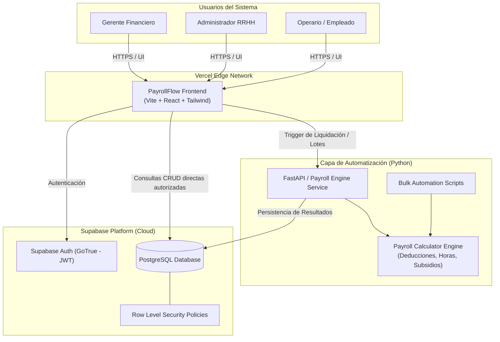

# 🏛️ Documento de Diseño de Arquitectura (C4 Model)

## 1. Visión General
La arquitectura de **PayrollFlow** sigue un patrón desacoplado y orientado a servicios ligeros:
* **Frontend:** Single Page Application (SPA) construida en React + Vite + Tailwind CSS, desplegada en Vercel Edge Network.
* **Backend de Automatización:** Motor de reglas y cálculos en Python, consumido vía API REST / scripts batch.
* **Capa de Datos & Auth:** Supabase (PostgreSQL 15+, Auth con JWT, Storage y Row Level Security).

---

## 2. Diagrama de Arquitectura (Nivel Contexto y Contenedores)

---

## 3. Decisiones Arquitectónicas Clave (ADRs)

### ADR-01: Supabase + PostgreSQL como Base de Datos Principal
* **Contexto:** Se requiere un motor relacional sólido para transacciones financieras y control de acceso estricto.
* **Decisión:** Adoptar Supabase por su soporte nativo de PostgreSQL, integración de autenticación JWT y Row Level Security (RLS).
* **Beneficio:** Evita escribir middleware redundante para autenticación y garantiza que la seguridad de los datos resida en la propia base de datos.

### ADR-02: Motor de Cálculo y Automatización en Python
* **Contexto:** 4 integrantes del equipo tienen perfil de Analítica de Datos y 2 de IA/Automatización.
* **Decisión:** Implementar las rutinas de cálculo, validación matemática y scripts de carga en Python.
* **Beneficio:** Curva de aprendizaje cero para el equipo de datos, soporte para librerías de validación contable y facilidad para crear scripts de testing automatizado.

### ADR-03: Despliegue Frontend en Vercel
* **Contexto:** Se requiere entrega continua y rendimiento óptimo en la interfaz web de React.
* **Decisión:** Utilizar Vercel vinculado directamente al repositorio de GitHub.
* **Beneficio:** Despliegue automático con cada `push` a la rama `main` y soporte nativo para previsualizaciones de Pull Requests.

---

## 4. Flujo de Datos para la Liquidación

1. **Paso 1 (Configuración):** El Admin define en el frontend el catálogo de `profiles` con su tarifa horaria (`hourly_rate`).
2. **Paso 2 (Novedades):** El Admin ingresa o carga las horas trabajadas de cada empleado en `time_logs`.
3. **Paso 3 (Ejecución):** El Admin presiona "Ejecutar Liquidación". La petición viaja al motor de Python (`/api/v1/payroll/calculate`).
4. **Paso 4 (Cálculo):** El motor en Python:
   - Consulta empleados activos y sus horas.
   - Aplica las fórmulas de salario base, subsidio por hijos y retenciones de ley.
   - Genera el encabezado `payroll_runs` y las líneas de detalle `payroll_details`.
5. **Paso 5 (Revisión y Aprobación):** El Gerente ingresa al dashboard, valida los totales y cambia el estado a `APROBADO`.
6. **Paso 6 (Publicación):** Los operarios ven habilitada su colilla de pago en su sesión individual.
