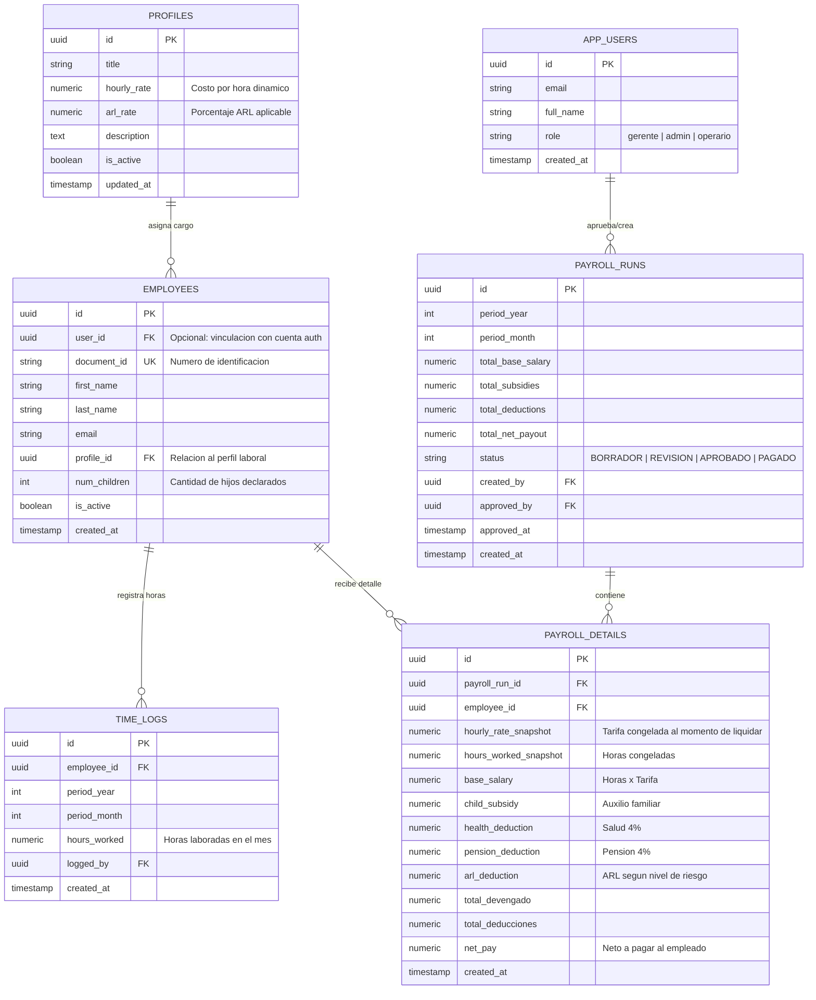

# 🗄️ Diccionario de Datos y Modelo Entidad-Relación

Este documento especifica la estructura relacional de la base de datos alojada en **Supabase (PostgreSQL)**, detallando tipos de datos, llaves foráneas, restricciones de integridad y auditoría.

---

## 1. Diagrama Entidad-Relación (ERD)

---

## 2. Diccionario de Tablas

### 2.1. Tabla: `profiles`
Almacena los perfiles de cargo y sus tarifas horarias dinámicas.

| Columna | Tipo | Nulo | Descripción |
| :--- | :--- | :---: | :--- |
| `id` | `UUID` | No | Identificador único (Primary Key, `gen_random_uuid()`). |
| `title` | `VARCHAR(100)` | No | Nombre del cargo (ej. "Operario Nivel 1", "Técnico Senior"). |
| `hourly_rate` | `NUMERIC(14,2)` | No | Costo por hora dinámica en COP. |
| `arl_rate` | `NUMERIC(5,4)` | No | Porcentaje de ARL asignado (ej. 0.0052 para Nivel I). |
| `description` | `TEXT` | Sí | Descripción de las funciones del perfil. |
| `is_active` | `BOOLEAN` | No | Estado de vigencia (Default: `true`). |
| `created_at` | `TIMESTAMPTZ` | No | Fecha y hora de creación. |
| `updated_at` | `TIMESTAMPTZ` | No | Última fecha de actualización de la tarifa. |

### 2.2. Tabla: `employees`
Registro maestro de colaboradores de la empresa.

| Columna | Tipo | Nulo | Descripción |
| :--- | :--- | :---: | :--- |
| `id` | `UUID` | No | Identificador único del empleado. |
| `user_id` | `UUID` | Sí | Referencia a `auth.users(id)` si cuenta con acceso al portal. |
| `document_id` | `VARCHAR(20)` | No | Cédula o documento de identidad (Único). |
| `first_name` | `VARCHAR(100)` | No | Nombres del empleado. |
| `last_name` | `VARCHAR(100)` | No | Apellidos del empleado. |
| `email` | `VARCHAR(150)` | No | Correo institucional o personal. |
| `profile_id` | `UUID` | No | Llave foránea a `profiles(id)`. |
| `num_children`| `INTEGER` | No | Cantidad de hijos acreditados (Default: `0`, Check: $\ge 0$). |
| `is_active` | `BOOLEAN` | No | Estado contractual (Default: `true`). |
| `created_at` | `TIMESTAMPTZ` | No | Fecha de vinculación. |

### 2.3. Tabla: `time_logs`
Registro de horas trabajadas por colaborador en cada ciclo mensual.

| Columna | Tipo | Nulo | Descripción |
| :--- | :--- | :---: | :--- |
| `id` | `UUID` | No | Primary Key. |
| `employee_id` | `UUID` | No | Llave foránea a `employees(id)`. |
| `period_year` | `INTEGER` | No | Año del reporte (ej. 2026). |
| `period_month`| `INTEGER` | No | Mes del reporte (1 a 12). |
| `hours_worked`| `NUMERIC(6,2)` | No | Cantidad de horas reportadas (Check: $\ge 0$). |
| `logged_by` | `UUID` | No | Usuario que registró las horas. |
| `created_at` | `TIMESTAMPTZ` | No | Timestamp de auditoría. |

### 2.4. Tabla: `payroll_runs`
Cabecera del lote de nómina ejecutado para un período específico.

| Columna | Tipo | Nulo | Descripción |
| :--- | :--- | :---: | :--- |
| `id` | `UUID` | No | Primary Key. |
| `period_year` | `INTEGER` | No | Año del ciclo de pago. |
| `period_month`| `INTEGER` | No | Mes del ciclo de pago. |
| `total_base_salary` | `NUMERIC(16,2)` | No | Consolidado total de salarios base devengados. |
| `total_subsidies` | `NUMERIC(16,2)` | No | Consolidado total pagado por auxilio de hijos. |
| `total_deductions`| `NUMERIC(16,2)` | No | Consolidado total retenido por ley. |
| `total_net_payout`| `NUMERIC(16,2)` | No | Total líquido desembolsado por la empresa. |
| `status` | `VARCHAR(20)` | No | Estado (`BORRADOR`, `REVISION`, `APROBADO`, `PAGADO`). |
| `created_by` | `UUID` | No | Usuario que ejecutó la liquidación. |
| `approved_by`| `UUID` | Sí | Gerente que autorizó el pago. |
| `approved_at`| `TIMESTAMPTZ` | Sí | Timestamp de la aprobación. |

### 2.5. Tabla: `payroll_details`
Detalle línea por línea de la liquidación individual de cada empleado.

| Columna | Tipo | Nulo | Descripción |
| :--- | :--- | :---: | :--- |
| `id` | `UUID` | No | Primary Key. |
| `payroll_run_id` | `UUID` | No | Llave foránea a `payroll_runs(id)`. |
| `employee_id` | `UUID` | No | Llave foránea a `employees(id)`. |
| `hourly_rate_snapshot` | `NUMERIC(14,2)` | No | Tarifa por hora congelada al momento de liquidar. |
| `hours_worked_snapshot`| `NUMERIC(6,2)` | No | Horas congeladas al momento de liquidar. |
| `base_salary` | `NUMERIC(14,2)` | No | `hourly_rate_snapshot * hours_worked_snapshot`. |
| `child_subsidy` | `NUMERIC(14,2)` | No | Valor del subsidio según tabla de hijos. |
| `health_deduction` | `NUMERIC(14,2)` | No | $4\%$ sobre Salario Base. |
| `pension_deduction` | `NUMERIC(14,2)` | No | $4\%$ sobre Salario Base. |
| `arl_deduction` | `NUMERIC(14,2)` | No | Porcentaje ARL sobre Salario Base. |
| `total_devengado` | `NUMERIC(14,2)` | No | Salario Base + Subsidio Hijos. |
| `total_deducciones` | `NUMERIC(14,2)` | No | Salud + Pensión + ARL. |
| `net_pay` | `NUMERIC(14,2)` | No | Total Devengado - Total Deducciones. |
